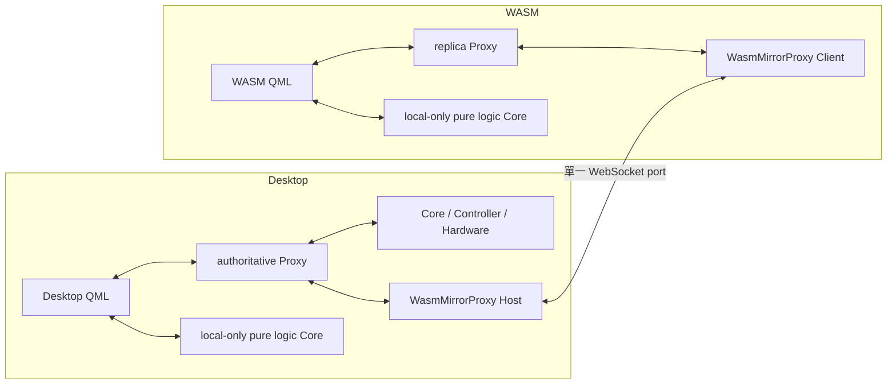

# Config-only WasmMirrorProxy 整合指南

本文件說明如何把本專案目前的 `WasmMirrorProxy` 整合到既有 Qt/QML 專案。

這個版本採用 **Config-only** 介面：Mirror 只負責 Desktop 與 WebAssembly 之間的 Proxy 同步，不負責建立 `QQmlApplicationEngine`，也不負責把物件註冊到 QML。既有專案可以繼續使用原本的 `qmlRegisterSingletonInstance()`、QML context property 或 `setInitialProperties()`。

## 0. 導入成本總覽

照本文件把 Mirror 導入既有專案，實際要動的東西一共五類：

1. **放入 package**：§1 的 5 個 C++ 檔 + 2 個 CMake 檔，原樣複製。
2. **改 CMake**：依賴（§2）、來源檔分流（§11）、Proxy 註冊（§3）、WASM preset（§13）。
3. **改 main**：composition root 組裝 Config 與生命週期（§9、§10）。
4. **補齊 Proxy 契約**：每個要同步的 Q_PROPERTY 必須 READ+WRITE+NOTIFY（§4.1）。
   採「QML 唯讀 Proxy」慣例的專案要在 header 補 `WRITE`（setter 通常已存在）。
5. **自備 HTTP server** 服務 WASM 頁面（§14.2；package 刻意不含 HTTP server）。

若要通過 §14.2 step 8 的離線顯示，另需實作 §5.1 的 transport 狀態（強烈建議）。

最小啟動方式如下：

```cpp
WasmMirrorConfig config;
config.host = QStringLiteral("127.0.0.1");
config.port = 8125;

if (!config.addProxy(QStringLiteral("OpcuaKepware"), *opcua)) {
    qCritical().noquote() << config.validationError();
    return EXIT_FAILURE;
}

QString mirrorError;
auto mirror = WasmMirrorProxy::create(config, &mirrorError);
if (!mirror) {
    qCritical().noquote() << mirrorError;
    return EXIT_FAILURE;
}
```

同一份程式碼在不同編譯目標會有不同角色：

- Windows Desktop：建立 authoritative Proxy Mirror WebSocket Server。
- Qt WebAssembly：建立 replica Proxy Mirror WebSocket Client、自動握手、同步及重連。
- 會接觸硬體或程序資源的 authoritative Core、OPC UA、Modbus、PLC thread 只存在 Desktop。
- 純計算、無硬體副作用的 local Core 可以在 Desktop 與 WASM 各自建立；它不需要加入 Mirror。
- 需要跨端一致或 authoritative state 的 QML API，在兩邊都只面對相同 Proxy；明確 target-local 的純邏輯 helper 可直接在各端使用。
- WASM 頁面的 HTTP server 由導入專案提供；Mirror 本身只提供 WebSocket transport。



## 1. 需要複製的檔案

把以下檔案放進既有專案。建議保留相同的相對目錄，這樣現有 `#include` 不需要修改。

```text
cmake/
├─ WasmMirrorProxyRegister.cmake
└─ GenerateProxyRequestRelay.cmake

src/infrastructure/proxy_mirror/
├─ proxymirror.h
├─ proxymirror.cpp
├─ proxyrequestrelay.h
├─ wasmmirrorproxy.h
└─ wasmmirrorproxy.cpp
```

各檔案責任如下：

| 檔案 | 功能 |
|---|---|
| `proxymirror.h/.cpp` | 單一 QObject Proxy 的 contract、Snapshot、Patch、property write、一般 signal、revision、session、防重播與防循環寫入。 |
| `wasmmirrorproxy.h/.cpp` | Config-only 公開入口；Desktop 建立一個 WebSocket Server，WASM 建立一個 WebSocket Client，並用 `mirrorName` multiplex 多個 Proxy。 |
| `proxyrequestrelay.h` | 一般 signal 的 type-erased relay 公開宣告。 |
| `WasmMirrorProxyRegister.cmake` | 讓每一種 Proxy C++ 類別註冊到指定 target。 |
| `GenerateProxyRequestRelay.cmake` | 讀取 moc JSON，產生具型別的 signal relay C++。 |

以下檔案不是 Config-only Mirror 核心的一部分，不需要跟著複製：

- `proxysyncclient.h/.cpp`：舊的單一 `UiProxy` client transport；新 runtime 已整合這項責任。
- `webgateway.h/.cpp`：本 Demo 的 HTTP、React 與舊 WebSocket gateway；它不是 Mirror 核心。導入專案必須自備 HTTP server 或既有靜態網站服務來提供 WASM 頁面。
- React 專案：Mirror 不依賴 React。
- Modbus、OPC UA、`SystemCore`：這些屬於既有專案的 Desktop backend，不屬於 Mirror 模組。

另外注意：package 內部（`proxy_mirror/`）含 transport 自用的 `QObject::connect`。
若貴專案有「connect 只能出現在特定目錄」之類的架構靜態檢查，請把 package
目錄列入排除，避免誤報。

## 2. Qt 與 CMake 依賴

Mirror 核心本身需要：

```cmake
cmake_minimum_required(VERSION 3.21)

find_package(Qt6 REQUIRED COMPONENTS
    Core
    Network
    WebSockets
)
```

如果應用程式使用 QML，應用程式本身仍需依專案內容加入：

```cmake
find_package(Qt6 REQUIRED COMPONENTS
    Gui
    Qml
    Quick
    QuickControls2
)
```

`WasmMirrorProxy` 核心刻意不依賴 `QQmlApplicationEngine`。因此沒有 QML 的 Qt client 也可以使用這個 transport。

### 2.1 加入來源檔

以下範例假設既有專案有一個同時供 Desktop 與 WASM 使用的 `MyApplicationCore` target：

```cmake
add_library(MyApplicationCore STATIC
    # 既有來源檔……

    src/infrastructure/proxy_mirror/proxymirror.cpp
    src/infrastructure/proxy_mirror/proxymirror.h
    src/infrastructure/proxy_mirror/wasmmirrorproxy.cpp
    src/infrastructure/proxy_mirror/wasmmirrorproxy.h
    src/infrastructure/proxy_mirror/proxyrequestrelay.h
)

target_include_directories(MyApplicationCore
    PUBLIC
        "${CMAKE_CURRENT_SOURCE_DIR}/src"
)

target_link_libraries(MyApplicationCore
    PUBLIC
        Qt6::Core
        Qt6::Network
        Qt6::WebSockets
)
```

應用程式 target 再連結這個 Core：

```cmake
target_link_libraries(MyApplication
    PRIVATE
        MyApplicationCore
        Qt6::Gui
        Qt6::Qml
        Qt6::Quick
)
```

如果 Desktop 與 WASM 使用不同的 Core target，兩個 target 都要加入 Mirror 來源檔
與 Qt 依賴。具型別 signal relay 只在 WASM 端攔截本機 signal，因此
`wasm_mirror_register_proxy()`／`finalize` **至少必須加入 WASM 真正連結的
target**；Desktop Host 接收遠端 envelope 時可只靠 meta-object。若兩端共用
同一個 Core target（如本 Demo），在該共用 target 註冊一次即可。

## 3. 註冊 Proxy C++ 類別

Q_PROPERTY 狀態可以透過 Qt meta-object 在執行期處理；WASM 本機的一般 signal
參數則需要在編譯期產生具型別 relay。因此，每一種會在 WASM Config 中加入的
Proxy **具體 C++ 類別** 都必須在 WASM target 的 CMake 註冊。

先 include 註冊模組：

```cmake
include(cmake/WasmMirrorProxyRegister.cmake)
```

然後註冊所有 Proxy 類別：

```cmake
wasm_mirror_register_proxy(
    TARGET MyApplicationCore
    CLASS OpcUaKepwareProxy
    HEADER "${CMAKE_CURRENT_SOURCE_DIR}/src/proxy/opcuakepwareproxy.h"
)

wasm_mirror_register_proxy(
    TARGET MyApplicationCore
    CLASS AlarmProxy
    HEADER "${CMAKE_CURRENT_SOURCE_DIR}/src/proxy/alarmproxy.h"
)

wasm_mirror_register_proxy(
    TARGET MyApplicationCore
    CLASS SettingsProxy
    HEADER "${CMAKE_CURRENT_SOURCE_DIR}/src/proxy/settingsproxy.h"
)

wasm_mirror_finalize_proxy_registration(TARGET MyApplicationCore)
```

順序規則：

1. 先建立 target。
2. 先設定 target 的 include directories 與 compile definitions。
3. 呼叫一次或多次 `wasm_mirror_register_proxy()`。
4. 所有類別註冊完後，只呼叫一次 `wasm_mirror_finalize_proxy_registration()`。
5. `finalize` 之後不可再註冊新的類別。

其他限制：

- `TARGET` 必須是真實且可編譯的 target，不能傳 alias 或 imported target。
- `HEADER` 必須存在。
- 類別必須繼承 `QObject` 並包含 `Q_OBJECT`。
- `CLASS` 可以是 namespace-qualified 名稱，例如 `Machine::AlarmProxy`。
- 同一類別在同一 target 只註冊一次。
- 同一類別的多個不同實體不需要重複 CMake 註冊；在 Config 中用不同 `mirrorName` 加入即可。
- relay 目前要求執行期物件的 `metaObject()` 就是註冊的具體類別；不要只註冊 base class，卻傳入未註冊的 derived Proxy。

產生器會在 build directory 建立：

```text
generated/wasm_mirror/<target>/
├─ registrations.cmake
├─ moc_<class>_for_relay.cpp.json
└─ proxy_event_relay_generated.cpp
```

這些都是建置產物，不要加入版本控制，也不要手動修改。

`proxyrequestrelay.h` 與部分產生器內部仍沿用早期的 request 命名，但現在的
語意是「所有非 Q_PROPERTY NOTIFY 的 public typed signal」，signal 名稱不需要
`request` 前綴。

新增或修改一般 signal 後，正常增量編譯應重新執行 moc 與 relay 產生器。如果沒有重新產生，請先 Reload CMake，再做 fresh build。

## 4. Proxy contract 規則

Desktop 與 WASM 必須用同一份 Proxy header 建置。Mirror 會根據 Qt meta-object 建立 contract hash；兩邊 contract 不一致時會拒絕整條 required 連線，不會進行部分同步。

### 4.1 Q_PROPERTY：雙向狀態同步

預設會同步「由該具體 Proxy 類別宣告、`STORED true`、非 `CONSTANT`」的 Q_PROPERTY。

```cpp
class OpcUaKepwareProxy final : public QObject
{
    Q_OBJECT
    Q_PROPERTY(int testCount
               READ testCount
               WRITE setTestCount
               NOTIFY testCountChanged)

public:
    int testCount() const { return m_testCount; }

    void setTestCount(int value)
    {
        if (m_testCount == value) {
            return;
        }
        m_testCount = value;
        emit testCountChanged(value);
    }

signals:
    void testCountChanged(int value);

private:
    int m_testCount = 0;
};
```

每個同步 property 必須具備：

- `READ`：Snapshot/Patch 產生時可讀取目前值。
- `WRITE`：另一端可透過同一個 setter 套用值。
- `NOTIFY`：值改變時 Mirror 才知道要產生 Patch。
- 支援的資料型別

這三項是同步 property 的必要契約。缺少任一項都不是「單向同步」，而是無效
contract；`WasmMirrorProxy::create()` 會拒絕啟動。若狀態不應跨端同步，請明確
標成 `STORED false` 或 `CONSTANT`，不要用省略 `WRITE`／`NOTIFY` 來表達本機狀態。

| Property 用途 | READ | WRITE | NOTIFY | STORED | Mirror 行為 |
|---|---:|---:|---:|---:|---|
| Desktop/WASM 雙向同步 | 必須 | 必須 | 必須 | `true`（預設） | 進入 contract、Snapshot 與 Patch |
| target-local UI 狀態 | 建議 | 視 QML 需求 | 建議 | `false` | 不進入 Mirror contract |
| 編譯期常數 | 必須 | 不可 | 不需 | 任意 | 不進入 Mirror contract |

NOTIFY 可使用以下任一形式：

```cpp
void testCountChanged();
```

或：

```cpp
void testCountChanged(int value);
```

若 NOTIFY 有一個參數，參數型別必須與 Q_PROPERTY 完全相同。NOTIFY 不可有兩個以上參數。

如果多個 property 共用同一個零參數 NOTIFY，Mirror 可以一次重新讀取它們；但帶值的 NOTIFY 不可由兩個 property 共用，因為單一參數無法表示兩個狀態。

目前支援的 property 與 signal 參數型別：

```text
bool
int
uint
qint64 / qlonglong
quint64 / qulonglong
double
QString
QByteArray
QStringList
QVariantList
QVariantMap
```

不在清單內的 enum、自訂 struct、QObject pointer 或 container，必須先轉換成支援的 UI-facing 型別。

若某個 property 只供目前 target 的本機 UI 使用，不需要跨 Desktop/WASM 同步，使用：

```cpp
Q_PROPERTY(QString transportMessage
           READ transportMessage
           NOTIFY transportMessageChanged
           STORED false)
```

`STORED false` 與 `CONSTANT` 不會進入 Snapshot/Patch，也不會影響 contract 的同步狀態。它們的 NOTIFY 仍會被辨識為狀態通知，不會被錯誤當成一般遠端 signal。

重要事項：

- Mirror 只掃描具體類別本身宣告的 property；不要依賴 base class 的 Q_PROPERTY 自動加入這份 contract。
- setter 應先比較新舊值，避免相同值造成不必要的 NOTIFY 與 Patch。
- Desktop 與 WASM 都必須使用同一個 setter/NOTIFY API。
- QML 不需要判斷 `Q_OS_WASM`。
- WASM 套用 Desktop Snapshot/Patch 時會抑制反向 echo，不會循環寫入。
- Snapshot/Patch 會先驗證全部欄位，再原子套用；不會只更新成功的一半。
- Host 端同一個 event-loop 回合內的多個 property 變更會合併成**一個** Patch
  再送出（`flushPatch` 以 `QTimer::singleShot(0, ...)` 排程）。高頻變動的
  property（例如毫秒計時值）實際 patch 頻率上限即事件迴圈頻率，不會一個
  NOTIFY 一個封包；但仍建議避免把不必要的高頻內部狀態做成同步 property。

### 4.2 一般 signal：WASM UI 到 Desktop Core 的事件

所有由具體 Proxy 類別宣告、且不是 Q_PROPERTY NOTIFY 的 public signal，都會被視為 UI event：

```cpp
signals:
    void startCountdown(int seconds);
    void acknowledgeAlarm(int alarmId, const QString &operatorName);
    void emergencyStop();
```

不需要 `request` 前綴。以下兩個名稱都有效：

```cpp
void requestStartCountdown(int seconds);
void startCountdown(int seconds);
```

Desktop Core 繼續使用原本的 Qt connect：

```cpp
connect(opcua,
        &OpcUaKepwareProxy::startCountdown,
        this,
        &Core::startCountdown);
```

流程為：

```text
WASM QML
→ WASM replica Proxy 發出 signal
→ WasmMirrorProxy WebSocket
→ Desktop authoritative Proxy 重發相同 signal
→ Core 原本的 slot
```

一般 signal 契約：

- 必須是 public signal。
- signal 參數必須使用前述支援型別。
- 同一個 Proxy 類別不可 overload 一般 signal 名稱；例如同時宣告 `start(int)` 和 `start(QString)` 會在 relay 產生階段報錯。
- 沒有 Desktop handler 並不會造成 transport 啟動失敗；signal 仍會被安全發出，只是沒有 slot 處理。這可用來暫時停用功能。
- 一般 signal 是 UI/WASM 到 authoritative Desktop Core 的事件，不是持久狀態。需要顯示與持續同步的值應使用 Q_PROPERTY。
- Mirror 只處理具體類別本身宣告的一般 signal。
- **離線語意**：WASM 與 Desktop 斷線期間，發出的一般 signal 與同步 property
  寫入會被**直接丟棄——不排隊、重連後也不補送**（transport 在 socket 非
  connected 時丟棄外送訊息）。需要可靠投遞的操作，應用層要自行設計確認或
  重試機制，例如以同步 property 回讀操作結果。

## 5. 單一 Proxy Config

### 5.1 Config 預設值

| 欄位 | 核心預設 | 說明 |
| --- | --- | --- |
| `host` | `127.0.0.1` | 只允許 loopback |
| `port` | `8124` | 通用核心預設；本 Demo 因 8124 已給 legacy React，明確改用 8125 |
| `path` | `/` | 空字串或缺少前導 `/` 會正規化 |
| `allowedOrigins` | `http://127.0.0.1:8123`、`http://localhost:8123` | 瀏覽器 Origin allowlist |

既有專案不能只依賴 port 預設值；應在 Desktop 與 WASM 共用的組裝設定中明確
指定固定 port。本 Demo 必須使用 `8125`，避免與固定監聽的 React legacy
`8124` 衝突。

既有專案只有一個 Proxy 時：

```cpp
WasmMirrorConfig config;
config.host = QStringLiteral("127.0.0.1");
config.port = 8125;
config.path = QStringLiteral("/mirror");
config.allowedOrigins = {
    QStringLiteral("http://127.0.0.1:8123"),
    QStringLiteral("http://localhost:8123")
};

WasmMirrorProxyOptions options;
options.required = true;

#if defined(Q_OS_WASM)
opcua->setTransportState(
    false, QStringLiteral("Connecting to the Qt desktop Core..."));
options.transportStateHandler =
    [opcua](bool ready, const QString &message) {
        opcua->setTransportState(ready, message);
    };
#endif

if (!config.addProxy(QStringLiteral("OpcuaKepware"),
                     *opcua,
                     std::move(options))) {
    qCritical().noquote() << config.validationError();
    return EXIT_FAILURE;
}

QString error;
auto mirror = WasmMirrorProxy::create(config, &error);
if (!mirror) {
    qCritical().noquote() << "Cannot start WASM Mirror:" << error;
    return EXIT_FAILURE;
}

qInfo().noquote()
    << "WASM Mirror endpoint:"
    << mirror->webSocketUrl().toString();
```

`transportStateHandler` 是選配 callback，適合把 WASM transport 狀態寫入 `STORED false` 的 UI overlay，例如 `transportReady`、`connectionMessage`。不要把 transport 狀態做成跨端同步 property，否則 Desktop 的 transport 狀態可能覆蓋 WASM 的本機狀態。

Mirror 的必要行為與應用程式的視覺行為要分開驗收：

- **必要**：斷線後不再把 property/event 送到 Desktop、保留最後一份 authoritative Snapshot 作為同步基準、依退避策略重連，所有 required Snapshot 完成後才重新允許 transport writes。
- **條件式**：只有設定 `transportStateHandler` 並提供 `STORED false` overlay 的專案，才要求 QML 顯示 offline、連線訊息或停用操作元件。

因此不提供 handler 仍是有效整合；頁面可能保留最後狀態且不顯示 offline，但
transport 仍會自動重連。若產品規格要求使用者明確看見離線狀態，才把這個
callback 與對應的 local-only property 納入該應用程式的必要導入步驟。

注意：停止 transport writes 不會攔截 Proxy 自己的 setter；離線時仍讓 QML 直接
修改同步 property，會改變 WASM replica 的本機畫面，只是不會送到 Desktop。
配置 overlay 的專案必須停用所有會直接寫 property 或發 event 的控制項，才能讓
畫面持續顯示最後一份 authoritative state。

共用 Proxy 的 transport member 建議預設為 `true`，確保 Desktop UI 不會等待一個
不存在的遠端 transport；只有 WASM composition root 在載入 QML 前明確切為
`false`，再由 handler 維護。本 Demo 目前以 `Q_OS_WASM` 條件初值達成相同結果，
但移植 package 時優先把平台選擇留在 composition root。採用 transport overlay 的
應用程式不能省略 handler。多 Proxy 時 handler 是 per-proxy 狀態，
不等同 runtime 的全域 `isReady()`；optional Proxy 可維持 false，而所有 required
Proxy ready 後，runtime 的 `isReady()` 仍可為 true。

`WasmMirrorProxy::isReady()` 的意義：

- Desktop：WebSocket Server 已成功 listen。
- WASM：已完成 welcome，且所有 required Proxy 都已收到完整 Snapshot。

可觀測 API：

| API | 語意 |
| --- | --- |
| `readyChanged(bool)` | 整體 ready 狀態改變 |
| `proxyReadyChanged(mirrorName, bool)` | 單一具名 Proxy 的 ready 狀態改變 |
| `transportError(mirrorName, message)` | 連線、handshake 或 contract 錯誤診斷 |
| `actualPort()` | Desktop 實際 listen port；固定 port 時等於 Config |
| `webSocketUrl()` | 正規化後的實際 endpoint |

Desktop 的 `isReady()==true` 只表示 server 已成功 listen，不代表已有 WASM client
連線；每個 Proxy 的遠端 snapshot readiness 主要由 WASM 端觀測。

## 6. 多個 Proxy Config

多個 Proxy 應共用一個 `WasmMirrorProxy`、一個 port 與一條 WebSocket；不要每個 Proxy 開一個 port。

```cpp
WasmMirrorConfig config;
config.host = QStringLiteral("127.0.0.1");
config.port = 8125;

if (!config.addProxy(QStringLiteral("OpcuaKepware"), *opcua)
    || !config.addProxy(QStringLiteral("Alarm"), *alarm)
    || !config.addProxy(QStringLiteral("Settings"), *settings)) {
    qCritical().noquote() << config.validationError();
    return EXIT_FAILURE;
}

QString error;
auto mirror = WasmMirrorProxy::create(config, &error);
if (!mirror) {
    qCritical().noquote() << error;
    return EXIT_FAILURE;
}
```

Desktop 與 WASM 的 `mirrorName` 必須完全一致，包括大小寫：

| Desktop | WASM |
|---|---|
| `OpcuaKepware` | `OpcuaKepware` |
| `Alarm` | `Alarm` |
| `Settings` | `Settings` |

`mirrorName` 是 wire protocol 的路由名稱，與 QML singleton 名稱是不同概念；不過建議兩者使用相同名稱，交接與 log 會比較清楚。

Config 規則：

- 名稱會先 `trimmed()`。
- 空白名稱會被拒絕。
- 重複名稱會被拒絕。
- 同一個 QObject 實體不可加入兩次。
- 不同 QObject 實體即使屬於同一個 C++ 類別，也可以用不同名稱加入。
- `mirrorNames()` 會以排序後的名稱回傳；不可依賴加入順序作為協定順序。
- Config 只在 `WasmMirrorProxy::create()` 時被快照。runtime 建立後再對原 Config
  呼叫 `addProxy()` 不會動態加入；要變更 registry，必須解構 runtime、修改
  Config 並重新 create，WASM client 也會重新 handshake。

每個 Proxy 獨立管理：

- contract hash
- state session
- revision
- Snapshot/Patch
- property cache
- ready 狀態

所有 Proxy 共用：

- WebSocket endpoint
- request session
- connection session
- 重連 timer

「共用一條 WebSocket」是以每個 WASM runtime／browser tab 為單位。Desktop
server 支援多個同時 client，每條連線擁有獨立 session；同一 Proxy 的 patch
會廣播給所有已成功接受該 `mirrorName` 的 client。

並發寫入語意：多個 client（含 Desktop 本地操作）同時寫同一個 property 時，
以寫入到達 Desktop authoritative Proxy 的順序依序套用，**後到者覆蓋先到者
（last-write-wins）**，每次套用都會廣播對應 patch；Mirror 不提供鎖或衝突
合併。預期多人同時操作的部署，應在應用層自行約束——例如以一般 signal 送進
Desktop Core 裁決，取代讓多端直接寫同一個 property。

### 6.1 required 與 optional

預設：

```cpp
WasmMirrorProxyOptions options;
options.required = true;
```

任一 required Proxy 缺少或 contract mismatch，整次 handshake 會被拒絕，不會先同步其他 Proxy。

選配 Proxy：

```cpp
WasmMirrorProxyOptions diagnosticsOptions;
diagnosticsOptions.required = false;

config.addProxy(QStringLiteral("Diagnostics"),
                *diagnostics,
                diagnosticsOptions);
```

只有兩邊都把該 Proxy 視為 optional 時，缺少或 contract 不同才可以略過。optional Proxy 未接受時不會阻止整體 `isReady()`；但該 Proxy 不會收送狀態或事件。

初次導入建議全部使用 `required = true`。確認真的需要跨版本選配模組後，再使用 optional。

## 7. Port、host、path 與 Origin

### 7.1 固定 port：正式使用最推薦

```cpp
config.host = QStringLiteral("127.0.0.1");
config.port = 8125;
```

這份 Demo 的 `WebGateway` 每次 Desktop 啟動都固定監聽 WebSocket `8124`，所以
新的 Mirror 必須明確使用 `8125`。若另一個既有專案沒有 legacy service 占用
`8124`，才可以使用核心預設的 `8124`。

固定 port 的優點：

- Desktop 與 WASM 都知道相同 endpoint。
- 不需要 discovery。
- 防火牆、測試與除錯較簡單。
- Desktop 重開後 WASM 可以連回同一個位置。

固定 port 被占用時，`create()` 會失敗並回傳可讀錯誤；不會偷偷改用另一個 port。

### 7.2 `port = 0`：只會在 Desktop 自動選 port

Desktop 可以使用：

```cpp
config.port = 0;

auto mirror = WasmMirrorProxy::create(config, &error);
if (mirror) {
    qInfo() << mirror->actualPort();
    qInfo() << mirror->webSocketUrl();
}
```

此時 OS 會選一個可用 port，`actualPort()` 與 `webSocketUrl()` 會回報實際值。

但 WebAssembly 無法只靠 `port = 0` 得知 Desktop 選到哪個 port，因此 WASM target 會直接拒絕啟動並回報：

```text
WebAssembly requires a fixed Proxy Mirror port or discovery.
```

目前 Mirror 核心沒有內建 discovery。若要在正式環境使用自動 port，既有專案必須額外提供其中一種方式：

- 固定 HTTP bootstrap endpoint，回傳實際 WebSocket URL。
- Desktop 開啟網頁時，把實際 port 放進 query parameter。
- 由外部 launcher/設定檔同時通知 Desktop 與網頁。

沒有 discovery 時，Desktop/WASM 整合一律使用固定 port。

### 7.3 host 限制

目前 Desktop Server 只允許 loopback address：

```text
127.0.0.1
localhost
::1
```

非 loopback 位址會被拒絕。這是刻意的安全界線，因為目前 transport 使用未加密的 `ws://`，也沒有帳號驗證。

若未來要跨機器連線，不應只把 host 改成 `0.0.0.0`；必須一起設計 WSS/TLS、認證、授權、Origin 及防火牆策略。

### 7.4 path

```cpp
config.path = QStringLiteral("/mirror");
```

- 空字串會轉成 `/`。
- 沒有 `/` 前綴時會自動補上。
- Desktop 會嚴格檢查 WebSocket request path。
- Desktop 與 WASM 必須使用相同 path。

### 7.5 allowedOrigins

瀏覽器 WebSocket 會帶 Origin。預設只接受：

```cpp
QStringList{
    QStringLiteral("http://127.0.0.1:8123"),
    QStringLiteral("http://localhost:8123")
};
```

如果網頁改用其他 HTTP port，必須同步修改 allowlist。例如網頁由 `http://127.0.0.1:9000` 提供：

```cpp
config.allowedOrigins = {
    QStringLiteral("http://127.0.0.1:9000"),
    QStringLiteral("http://localhost:9000")
};
```

空的 Origin 可供 native 測試 client 使用。把 `allowedOrigins` 設為空清單代表接受所有 Origin，不建議用於正式環境。

### 7.6 WASM 頁面的 HTTP server 由導入專案提供

`WasmMirrorProxy` 只提供 WebSocket 同步端點，不會提供 HTML、JavaScript、WASM
或 `qtloader.js`，也不會建立 HTTP server。導入專案必須自行選擇既有
`QHttpServer`、反向代理、產品內建 web server 或開發用靜態檔案 server，並用
HTTP(S) 提供 Qt 產生的完整 WASM 資產；不可直接用 `file://` 開啟 HTML。

HTTP server 與 Mirror WebSocket 可以使用不同 port，但必須同時滿足：

1. WASM 頁面連到 Config 指定的 `host`、`port` 與 `path`。
2. 頁面的完整 Origin（scheme、host、port）已加入 `allowedOrigins`。
3. HTTP server 指向最新建置輸出，至少包含 `.html`、`.js`、`.wasm` 與 Qt loader。
4. 若頁面使用 HTTPS，WebSocket 也必須提供 WSS；目前核心的 loopback 範例是 `ws://`，不能直接與 HTTPS 頁面混用。

本 Demo 的 `WebGateway` 只是上述責任的一個範例，不是導入 Mirror 的必要檔案。

## 8. QML 註冊與同一實體原則

Config-only Mirror 不會操作 `QQmlApplicationEngine`。既有 QML 註冊方式全部保留。

例如 singleton：

```cpp
qmlRegisterSingletonInstance<OpcUaKepwareProxy>(
    "Core", 1, 0, "OpcuaKepware", opcua);
```

接著把 **同一個實體** 加入 Config：

```cpp
config.addProxy(QStringLiteral("OpcuaKepware"), *opcua);
```

不要這樣做：

```cpp
OpcUaKepwareProxy qmlProxy;
OpcUaKepwareProxy mirrorProxy;

qmlRegisterSingletonInstance<OpcUaKepwareProxy>(
    "Core", 1, 0, "OpcuaKepware", &qmlProxy);

config.addProxy(QStringLiteral("OpcuaKepware"), mirrorProxy);
```

上述錯誤會讓 QML 修改 `qmlProxy`，Mirror 卻監看 `mirrorProxy`，畫面與 Desktop 永遠不同步。

如果既有專案使用 initial property：

```cpp
engine.setInitialProperties({
    {QStringLiteral("uiProxy"),
     QVariant::fromValue(static_cast<QObject *>(opcua))}
});
```

也同樣保留，Mirror 不需要 `engine` 參數。

### 8.1 Snapshot 前的空狀態

WASM replica 在收到第一份完整 Snapshot 前，只有 Proxy 建構子的預設值。清單、
Map 或尚未初始化的 QML 資料可能暫時為空；若 binding 直接索引資料，QML 可能
短暫輸出 `[undefined]` warning。這不代表 Mirror 已故障，但 UI 應主動容忍同步前
的狀態：

```qml
// 避免 model 尚未有第 1 筆資料時直接索引。
text: uiProxy.values.length > 0 ? uiProxy.values[0] : "--"
enabled: mirrorReady && uiProxy.values.length > 0
```

建議所有同步 property 在 C++ 建構時都有明確預設值，QML 對空清單、空字串及
尚未 ready 的狀態提供 placeholder，並在 required Snapshot 完成前停用會修改
遠端狀態的控制項。若應用程式沒有 transport overlay，可用自己的啟動畫面或
資料是否就緒條件保護 binding；不必為此把 transport 狀態加入 Mirror contract。

## 9. 物件生命週期

所有加入 Config 的 Proxy 都必須比 `WasmMirrorProxy` 活得久。Config 內部以 `QPointer` 追蹤物件；如果 Proxy 在 `create()` 前已經析構，建立會安全失敗。但 runtime 啟動後仍應維持明確的 ownership。

runtime 也會監聽 Proxy 的 `destroyed`，但此機制只負責避免 dangling pointer，
不應視為正常的動態移除 API：

- WASM 本機 required Proxy 被銷毀時，該 client 進入 terminal rejected 並停止重連。
- Desktop authoritative required Proxy 被銷毀時，server 回覆 `proxyDestroyed`；
  client 仍會依網路錯誤策略重連，但在物件恢復前不可能 ready。
- optional Proxy 在不同連線階段可能被 peer 略過或導致重新同步，不能依賴它
  進行 runtime hot-unplug。

正確作法是讓所有註冊物件活到 runtime 解構之後。需要變更 registry 時，應
解構 runtime、重建 Config，再建立新的 runtime。

runtime 與所有註冊 Proxy 應在 application／GUI main thread 建立並使用。Mirror
目前以直接 `QMetaProperty::read()`／`write()` 與 signal relay 存取 Proxy，沒有
替任意 worker-thread QObject 自動做 thread marshalling。硬體 worker 應由
Desktop Core 透過 queued signal/slot 隔離，不要把 worker QObject 本身註冊成
QML/Mirror Proxy。

建議宣告順序：

```cpp
QApplication app(argc, argv);

// Proxy owner 或 Core 先存在。
std::unique_ptr<OpcUaKepwareProxy> wasmProxyOwner;
OpcUaKepwareProxy *opcua = obtainProxy(...);

// Mirror 後建立，因此會先於 Proxy owner 析構。
auto mirror = WasmMirrorProxy::create(config, &error);

// Engine 最後建立，因此會最先析構。
QQmlApplicationEngine engine;
```

C++ 區域物件反向析構：

```text
QQmlApplicationEngine
→ WasmMirrorProxy
→ WASM replica Proxy owner
→ QApplication
```

`WasmMirrorProxy` 解構時會：

- Desktop 關閉所有 WebSocket client。
- Desktop 關閉 server 並釋放 port。
- WASM 停止重連 timer。
- WASM 關閉 WebSocket。
- 停止所有 Proxy 的本機 property write transport。

不要只保存：

```cpp
WasmMirrorProxy::create(config, &error);
```

回傳的 `unique_ptr` 會在該 statement 結束時立刻析構，Server/Client 也會立即停止。必須保存：

```cpp
auto mirror = WasmMirrorProxy::create(config, &error);
return app.exec();
```

不需要全域 singleton。composition root 中唯一的 RAII 實體已足夠，而且更容易測試與正確關閉。

## 10. `Core::instance()` 與 `OpcUaKepwareProxy` main 修改範例

先按責任把既有 Core 分成兩類；不要只因類別名稱叫 `Core` 就一律排除 WASM：

| Core 類型 | 例子 | Desktop | WASM | 是否進 Mirror |
|---|---|---:|---:|---:|
| authoritative hardware Core | PLC、OPC UA、Modbus、檔案／程序控制、worker thread | 建立 | 不建立 | 不直接進 Mirror；透過 Proxy 暴露狀態與事件 |
| local-only pure logic Core | Calculator、格式轉換、純驗證、只依輸入計算輸出 | 建立 | 各自建立 | 不進 Mirror；兩端獨立運算 |

判斷準則：若同一輸入一定得到同一輸出、不持有硬體連線、不存取程序全域資源、
不啟動 Desktop-only thread，而且兩端結果不需要由單一權威決定，就可以是
local-only Core。只要涉及硬體、共享設備狀態或必須只有一個執行者，就應留在
Desktop authoritative Core，透過 QML-facing Proxy 與 Mirror 溝通。

以下範例對應有硬體副作用的既有專案角色：

| 既有類別 | Mirror 架構角色 |
|---|---|
| `Core` | Desktop authoritative hardware Core/SystemCore |
| `OpcUaKepwareProxy` | QML-facing Proxy |
| `qmlRegisterSingletonInstance()` | 既有 QML 注入方式，保留 |

WASM 不可建立上述 authoritative `Core`、`PlcThread` 或硬體連線。它仍可建立
CalculatorCore 這類純邏輯 local Core。

`ProxyMode::MirrorReplica` **不是通用必要步驟**。如果 QML-facing Proxy 的建構子
只初始化 member、Q_PROPERTY 與 signal，不會連硬體、啟動 thread、註冊程序級
singleton 或產生其他副作用，Desktop/WASM 可直接使用相同建構方式，一行都不必
改。只有 Proxy 建構本身會啟動 Desktop-only 行為時，才需要拆出無副作用模式或
factory，例如：

mode 只能關閉建構與生命週期副作用；Desktop/WASM 仍必須建立同一個 concrete
Proxy class，並保有完全相同的 Q_PROPERTY 與 signal meta-object contract。不可
用 mode 或 `Q_OS_WASM` 條件式增刪同步 property/signal，否則 contract hash 或
generated relay 會拒絕連線。

```cpp
enum class ProxyMode
{
    Authoritative,
    MirrorReplica
};
```

以下是「Proxy 建構有副作用」時才需要的完整範例；`MirrorReplica` 建構子名稱需依
既有專案實際 API 調整。若 Proxy 本來就是被動資料物件，請直接在兩端正常建立，
不要為了 Mirror 額外增加 mode：

```cpp
int main(int argc, char *argv[])
{
    set_qt_environment();
    QApplication app(argc, argv);

    qInstallMessageHandler(messageHandler);

    // 宣告在 mirror 之前，確保 replica 比 mirror 活得久。
    std::unique_ptr<OpcUaKepwareProxy> wasmOpcuaOwner;
    OpcUaKepwareProxy *opcua = nullptr;

#if defined(Q_OS_WASM)
    // 只建立 QML-facing 狀態與 signal，不連 OPC UA/PLC/硬體。
    wasmOpcuaOwner = std::make_unique<OpcUaKepwareProxy>(
        ProxyMode::MirrorReplica,
        &app);
    opcua = wasmOpcuaOwner.get();
#else
    Core &core = Core::instance();
    core.init();

    opcua = get_m_kepware_proxy();
    if (!opcua) {
        qCritical() << "OpcUaKepwareProxy is null.";
        return EXIT_FAILURE;
    }

    QObject::connect(
        &app,
        &QCoreApplication::aboutToQuit,
        &app,
        [] {
            PlcThread::instance().shutdown();
        });
#endif

    ErrorMessage::instance();

    // Desktop 與 WASM 都向 QML 註冊同一個名稱、同一種 API。
    qmlRegisterSingletonInstance<OpcUaKepwareProxy>(
        "Core", 1, 0, "OpcuaKepware", opcua);

#if !defined(Q_OS_WASM)
    // 真正 Core 只存在 Desktop。
    qmlRegisterSingletonInstance<Core>(
        "Core", 1, 0, "Core", &Core::instance());
#endif

    WasmMirrorConfig mirrorConfig;
    mirrorConfig.host = QStringLiteral("127.0.0.1");
    mirrorConfig.port = 8125;
    mirrorConfig.path = QStringLiteral("/");
    mirrorConfig.allowedOrigins = {
        QStringLiteral("http://127.0.0.1:8123"),
        QStringLiteral("http://localhost:8123")
    };

    WasmMirrorProxyOptions opcuaOptions;
    opcuaOptions.required = true;

#if defined(Q_OS_WASM)
    // 若既有 Proxy 已有本機 transport UI 狀態，就在此回填。
    opcua->setTransportState(
        false, QStringLiteral("Connecting to the Qt desktop Core..."));
    opcuaOptions.transportStateHandler =
        [opcua](bool ready, const QString &message) {
            opcua->setTransportState(ready, message);
        };
#endif

    if (!mirrorConfig.addProxy(
            QStringLiteral("OpcuaKepware"),
            *opcua,
            std::move(opcuaOptions))) {
        qCritical().noquote() << mirrorConfig.validationError();
        return EXIT_FAILURE;
    }

    QString mirrorError;
    auto mirror = WasmMirrorProxy::create(
        mirrorConfig,
        &mirrorError);

    if (!mirror) {
        qCritical().noquote()
            << "Cannot initialize OpcuaKepware Mirror:"
            << mirrorError;
        return EXIT_FAILURE;
    }

    qInfo().noquote()
        << "Proxy Mirror endpoint:"
        << mirror->webSocketUrl().toString();

    // Engine 在 mirror 之後建立，結束時 QML 會先被銷毀。
    QQmlApplicationEngine engine;

    const QUrl url(mainQmlFile);
    QObject::connect(
        &engine,
        &QQmlApplicationEngine::objectCreated,
        &app,
        [url](QObject *object, const QUrl &objectUrl) {
            if (!object && url == objectUrl) {
                QCoreApplication::exit(EXIT_FAILURE);
            }
        },
        Qt::QueuedConnection);

    engine.addImportPath(
        QCoreApplication::applicationDirPath()
        + QStringLiteral("/qml"));
    engine.addImportPath(QStringLiteral(":/"));
    engine.load(url);

    if (engine.rootObjects().isEmpty()) {
        return EXIT_FAILURE;
    }

    return app.exec();
}
```

這個 main 的關鍵只有四點：

1. Desktop 才建立 `Core` 與硬體。
2. WASM 建立無硬體副作用的 replica `OpcUaKepwareProxy`；只有原建構子有副作用時才需要 `MirrorReplica` mode。
3. QML 註冊與 Mirror Config 使用同一個 `opcua` 指標。
4. `mirror` 保存到 `app.exec()` 結束。

純邏輯 local Core 若 QML 需要，可在 Desktop/WASM 各自建立並各自註冊；不要把它
加進 `WasmMirrorConfig`，也不要期待兩端 instance 共用狀態。

如果 QML 還直接使用：

```qml
Core.startMachine()
Core.someBackendValue
```

這些呼叫不會自動通過 `OpcUaKepwareProxy`。要讓 Desktop/WASM QML 使用方式一致，UI 需要的 API 應放到 Proxy：

```qml
OpcuaKepware.startMachine()
OpcuaKepware.someBackendValue
```

Desktop 再使用原本 signal/slot 把 Proxy 接到 Core。

## 11. Desktop 與 WASM 的 CMake 條件

Proxy header、Mirror 核心與 QML-facing API 必須是 Desktop/WASM 共用來源；硬體
backend、Desktop-only Qt module、tests 與 Windows GUI executable 屬性都必須一起
條件化。只切換 `.cpp` 仍會讓 WASM 在 configure 階段失敗。

下面是可直接套用的結構；實際 target 名稱與來源檔請換成既有專案名稱：

```cmake
include(CTest) # 先建立 BUILD_TESTING option

# 判斷 target platform，不是 CMake 所在的 Windows 開發主機。
set(MYAPP_IS_WASM OFF)
set(MYAPP_IS_WINDOWS_DESKTOP OFF)
if(EMSCRIPTEN)
    set(MYAPP_IS_WASM ON)
elseif(WIN32)
    set(MYAPP_IS_WINDOWS_DESKTOP ON)
else()
    message(FATAL_ERROR "This project supports Windows Desktop and WASM only")
endif()

# Desktop/WASM 共用；WASM Mirror client 仍需要 Network 與 WebSockets。
find_package(Qt6 REQUIRED COMPONENTS
    Core Gui Network Qml Quick QuickControls2 WebSockets
)

# 只能向 Desktop Qt kit 查找的 module。
if(MYAPP_IS_WINDOWS_DESKTOP)
    set(MYAPP_DESKTOP_QT_COMPONENTS SerialBus)
    # 若導入專案用 QHttpServer 提供頁面，再加入 HttpServer；否則使用自己的 server。
    # list(APPEND MYAPP_DESKTOP_QT_COMPONENTS HttpServer)
    if(BUILD_TESTING)
        list(APPEND MYAPP_DESKTOP_QT_COMPONENTS Test)
    endif()
    find_package(Qt6 REQUIRED COMPONENTS ${MYAPP_DESKTOP_QT_COMPONENTS})
endif()

set(MYAPP_CORE_SOURCES
    src/proxy/opcuakepwareproxy.cpp
    src/proxy/opcuakepwareproxy.h
    # 純邏輯 local Core 若兩端都需要，可放 common sources；它不加入 Mirror Config。
    # src/core/calculatorcore.cpp
    # src/core/calculatorcore.h
    src/infrastructure/proxy_mirror/proxymirror.cpp
    src/infrastructure/proxy_mirror/proxymirror.h
    src/infrastructure/proxy_mirror/wasmmirrorproxy.cpp
    src/infrastructure/proxy_mirror/wasmmirrorproxy.h
    src/infrastructure/proxy_mirror/proxyrequestrelay.h
)

if(MYAPP_IS_WINDOWS_DESKTOP)
    list(APPEND MYAPP_CORE_SOURCES
        src/core/core.cpp
        src/core/core.h
        src/hardware/plcthread.cpp
        src/hardware/plcthread.h
    )
endif()

add_library(MyApplicationCore STATIC ${MYAPP_CORE_SOURCES})
target_link_libraries(MyApplicationCore PUBLIC
    Qt6::Core Qt6::Network Qt6::WebSockets
)
if(MYAPP_IS_WINDOWS_DESKTOP)
    target_link_libraries(MyApplicationCore PUBLIC Qt6::SerialBus)
endif()

qt_add_executable(MyApplication
    src/main.cpp
)

# 只套用到 native Windows。WASM 必須讓 Qt 產生 HTML/JS/WASM launcher。
if(MYAPP_IS_WINDOWS_DESKTOP)
    set_target_properties(MyApplication PROPERTIES WIN32_EXECUTABLE TRUE)
endif()

target_link_libraries(MyApplication PRIVATE
    MyApplicationCore
    Qt6::Gui Qt6::Qml Qt6::Quick Qt6::QuickControls2
)

# qt_add_qml_module(...) 與 Mirror class registration 放在此處。

# Test module 與 test source 都不進 WASM configure/build graph。
if(MYAPP_IS_WINDOWS_DESKTOP AND BUILD_TESTING)
    add_subdirectory(tests)
endif()
```

三個常見 configure 陷阱：

1. 不要用 `CMAKE_HOST_WIN32` 判斷 Desktop；在 Windows 上交叉編譯 WASM 時它仍為 true。必須先判斷 `EMSCRIPTEN`，再判斷 `WIN32`。
2. `SerialBus`、`Test`（以及導入專案若使用的 `HttpServer`）的 `find_package`、source、link target 與 `add_subdirectory(tests)` 都要放進 Desktop branch；只條件化 link 不夠。
3. `WIN32_EXECUTABLE TRUE` 只能給 native Windows target，不能套用到 Emscripten。

CalculatorCore 這類 pure local Core 可以放在 common sources，但必須保持無 I/O、
無硬體連線、無 Desktop-only thread、無程序級 singleton／可變 global state，也不能
成為第二份 authoritative 設備狀態。它在兩端各自運算，不需要 `addProxy()`。

WASM 使用獨立 build cache 與 `wasm_singlethread` Qt kit。`QT_HOST_PATH` 指向 native
Qt 只供 moc/rcc 等 host tools；WASM target 的 Qt package 仍必須來自
`wasm_singlethread`。AutoMoc 在 build 階段也會執行 `em++.bat`，因此 CLion 應選
繼承 configure environment 的 WASM **build preset**，確保 EMSDK Python、Node 與
Emscripten PATH 在 configure 和 build 兩階段都存在。

不要在 Proxy header 或 QML 功能中到處加入 `#if defined(Q_OS_WASM)`。平台選擇集中在：

- composition root：決定建立真正 Core 或 replica Proxy。
- `WasmMirrorProxy` transport 內部：決定 Server 或 Client。

### 11.1 靜態架構掃描要排除 Mirror package

Mirror package 內部必須使用 `QObject::connect()` 完成 WebSocket、timer、property
NOTIFY 與 generated relay 的基礎設施接線；目前套件來源約有 18 處 `connect(`，
數量會隨版本調整。這些不是應用程式的 Core/business wiring。

若既有專案用文字掃描規則檢查「只有特定 composition root 可 connect Proxy」，
請排除以下範圍，再掃描應用程式自己的程式碼：

```text
src/infrastructure/proxy_mirror/
<build-directory>/generated/wasm_mirror/
```

不要為了讓掃描器通過而移除 package 內的 `connect()`；應調整掃描邊界。

## 12. CLion：MSVC Desktop preset

本專案使用 Qt 6.8.3、Visual Studio toolchain 與 Ninja。既有專案可在 `CMakePresets.json` 加入：

```json
{
  "version": 6,
  "configurePresets": [
    {
      "name": "debug-visual-studio",
      "displayName": "Debug-Visual Studio",
      "generator": "Ninja",
      "binaryDir": "${sourceDir}/cmake-build-debug-visual-studio",
      "toolchainFile": "C:/Qt/6.8.3/msvc2022_64/lib/cmake/Qt6/qt.toolchain.cmake",
      "cacheVariables": {
        "CMAKE_BUILD_TYPE": "Debug",
        "CMAKE_MAKE_PROGRAM": "C:/Qt/Tools/Ninja/ninja.exe",
        "BUILD_TESTING": "ON"
      },
      "environment": {
        "VSLANG": "1033"
      },
      "vendor": {
        "jetbrains.com/clion": {
          "toolchain": "Visual Studio"
        }
      }
    }
  ],
  "buildPresets": [
    {
      "name": "desktop-app",
      "configurePreset": "debug-visual-studio",
      "targets": ["MyApplication"]
    },
    {
      "name": "desktop-verify",
      "configurePreset": "debug-visual-studio",
      "targets": ["desktop_verify"]
    }
  ]
}
```

CLion 設定：

1. `Settings | Build, Execution, Deployment | Toolchains`。
2. 建立或選擇 `Visual Studio` toolchain。
3. Architecture 使用 `amd64/x64`。
4. CMake generator 使用 preset 中的 Ninja。
5. Reload CMake Project。
6. 平常 Desktop 編譯選 `Debug-Visual Studio`／`desktop-app`。
7. 完整驗證選 `desktop-verify`。

不要使用 MinGW target 連結 `msvc2022_64` Qt；編譯器 ABI 不相容。

## 13. CLion：Qt WebAssembly preset

Qt WASM kit 必須搭配相容的 Emscripten。以下範例使用團隊約定的標準安裝位置 `C:/tools/emsdk`。

> **警告**：本指南以 `wasm_singlethread` 為準。若改用 `wasm_multithread`，
> 瀏覽器要求 cross-origin isolation 才能啟用 SharedArrayBuffer——HTTP 回應
> 必須帶 `Cross-Origin-Opener-Policy: same-origin` 與
> `Cross-Origin-Embedder-Policy: require-corp`；`python -m http.server` 之類的
> 簡易 server 不會送這些 header，頁面會無法啟動。singlethread 無此需求。

```json
{
  "version": 6,
  "configurePresets": [
    {
      "name": "wasm-debug",
      "displayName": "WASM Configure Only",
      "generator": "Ninja",
      "binaryDir": "${sourceDir}/build-wasm",
      "toolchainFile": "C:/Qt/6.8.3/wasm_singlethread/lib/cmake/Qt6/qt.toolchain.cmake",
      "cacheVariables": {
        "CMAKE_BUILD_TYPE": "Debug",
        "CMAKE_MAKE_PROGRAM": "C:/Qt/Tools/Ninja/ninja.exe",
        "BUILD_TESTING": "OFF",
        "QT_CHAINLOAD_TOOLCHAIN_FILE": "C:/tools/emsdk/upstream/emscripten/cmake/Modules/Platform/Emscripten.cmake",
        "EMSCRIPTEN_ROOT_PATH": "C:/tools/emsdk/upstream/emscripten",
        "QT_HOST_PATH": "C:/Qt/6.8.3/msvc2022_64",
        "QT_HOST_PATH_CMAKE_DIR": "C:/Qt/6.8.3/msvc2022_64/lib/cmake",
        "CMAKE_CROSSCOMPILING_EMULATOR": "C:/tools/emsdk/node/16.20.0_64bit/bin/node.exe"
      },
      "environment": {
        "EMSDK": "C:/tools/emsdk",
        "EM_CONFIG": "C:/tools/emsdk/.emscripten",
        "EMSCRIPTEN": "C:/tools/emsdk/upstream/emscripten",
        "EMSDK_PYTHON": "C:/tools/emsdk/python/3.9.2-nuget_64bit/python.exe",
        "EMSDK_NODE": "C:/tools/emsdk/node/16.20.0_64bit/bin/node.exe",
        "PATH": "C:/tools/emsdk/python/3.9.2-nuget_64bit;C:/tools/emsdk/node/16.20.0_64bit/bin;C:/tools/emsdk/upstream/emscripten;C:/tools/emsdk/upstream/bin;C:/Qt/Tools/Ninja;C:/Qt/Tools/CMake_64/bin;C:/Qt/6.8.3/msvc2022_64/bin;C:/Windows/System32;C:/Windows"
      }
    }
  ],
  "buildPresets": [
    {
      "name": "wasm-client",
      "displayName": "Debug-WASM",
      "configurePreset": "wasm-debug",
      "inheritConfigureEnvironment": true,
      "targets": ["MyApplication"]
    }
  ]
}
```

CLion 中使用方式：

1. 先確認 Desktop `Debug-Visual Studio` 可正常 configure/build。
2. 確認 Qt `wasm_singlethread` 與 host Qt `msvc2022_64` 都已安裝。
3. 確認 preset 指向的 Emscripten、Python、Node 檔案實際存在。
4. Reload CMake Presets。
5. 建置時選 `wasm-client` build preset；不要拿 Desktop profile 直接編譯 WASM。
6. 輸出會位於 `build-wasm`，包含 `.html`、`.js`、`.wasm` 與 Qt loader 檔。

Qt 版本若不是 6.8.3，應一起更新：

- Desktop Qt toolchain path
- WASM Qt toolchain path
- `QT_HOST_PATH`
- 專案 `find_package(Qt6 ...)` 版本要求
- Qt 官方要求的 Emscripten 版本

## 14. 測試

### 14.1 Desktop 自動測試

本專案目前有三組 CTest：

```text
WebAssemblyTest.Workflow
WebAssemblyTest.ProxyMirror
WebAssemblyTest.WasmMirrorProxy
```

涵蓋：

- Desktop QML 冒煙與點擊。
- Q_PROPERTY Snapshot/Patch 雙向同步。
- 零參數及一參數 NOTIFY。
- 一般 typed signal。
- property echo suppression。
- contract mismatch。
- revision gap 與重新 Snapshot。
- session、防重播與 target 銷毀安全性。
- 多 Proxy 單一 endpoint。
- `mirrorName` property/signal/patch 路由。
- Runtime 關閉 client 並釋放 port。

CLion 可直接執行 `desktop-verify` target，或在 CTest/Test Runner 中執行全部測試。

整合到既有專案後，至少保留以下自動測試：

1. Config 拒絕空白與重複名稱。
2. 固定 port 正確 listen。
3. Desktop `port=0` 能回報實際 port。
4. 一條 WebSocket 能取得所有 required Proxy Snapshot。
5. 修改 A Proxy 不會修改 B Proxy。
6. WASM property write 只觸發對應 Desktop Proxy setter/NOTIFY。
7. WASM 一般 signal 只在對應 Desktop Proxy 發出一次。
8. contract mismatch 原子拒絕，不送部分 Snapshot。
9. runtime 解構後 client 斷線且 port 可重新 listen。

### 14.2 真實 WASM 網頁測試

Native CTest 無法取代真實瀏覽器。完成前必須實際測試編譯後的 WASM 頁面：

1. 用 `wasm-client` 建置 WASM。
2. 啟動 Desktop app，確認 log 顯示 Mirror endpoint，例如 `ws://127.0.0.1:8125/`；Windows GUI 看不到 log 時依 §15.10 設定 `QT_FORCE_STDERR_LOGGING=1`。
3. 由導入專案自備的 HTTP server 開啟 WASM `.html`，不可只用 `file://`，並確認 Origin 已在 allowlist。
4. 確認網頁自動連線，不需手動 Refresh；從初始載入、Synchronizing、Snapshot ready 到重連，console 不得出現未保護的 `undefined`、`TypeError`、`ReferenceError` 或 binding-loop warning。
5. Desktop 修改每個 Proxy 的 property，網頁應局部更新且不閃爍。
6. 網頁對每個 Proxy 至少修改一個產品允許 UI 寫入的同步 property，Desktop Core 應收到原本 NOTIFY/slot；完整 property contract 由自動測試或專用測試頁覆蓋。
7. 網頁點擊會發出一般 signal 的按鈕，Desktop handler 應只執行一次。
8. 關閉 Desktop，必要驗證 runtime 進入 not-ready、不再送出 property/event，並持續依退避策略重連。
9. **只有實作 `transportStateHandler`／local overlay 時**：驗證頁面顯示 offline、保留最後 authoritative state，且所有會直接寫同步 property 或發 event 的控制項都停用。本 Demo 有實作，因此此項是本 Demo 必測。
10. 用相同固定 port 重開 Desktop，網頁應自動重連；所有 required Proxy 的完整 Snapshot 都套用後才能 ready 並重新允許 writes。
11. 重連後再次測試 property 與 signal。

WASM client 的重連延遲為：

```text
250ms → 500ms → 1s → 2s → 4s → 5s → 每 5s
```

每次 WebSocket 連線後，welcome 與 required snapshots 必須在 **5 秒**內完成；
逾時會關閉該連線並進入上述重連退避。這可避免 TCP 已連線但 server 不回應時
永久停在 Synchronizing。

contract/protocol mismatch 是終止性錯誤，不會無限重連；WASM 本機 required
Proxy 被銷毀同樣會停止該 client。Desktop required Proxy 被銷毀則會持續拒絕
或觸發重連，直到應用程式以正確生命週期重建 runtime。

## 15. 疑難排解

### 15.1 `create()` 回傳 `nullptr`

先輸出完整錯誤：

```cpp
QString error;
auto mirror = WasmMirrorProxy::create(config, &error);
if (!mirror) {
    qCritical().noquote() << error;
}
```

常見原因：

- 沒有加入任何 Proxy。
- `addProxy()` 曾失敗，但呼叫端忽略 `false`。
- 名稱空白或重複。
- 同一 QObject 實體被加入兩次。
- Proxy 在 `create()` 前已析構。
- Q_PROPERTY 缺少 READ、WRITE 或 NOTIFY。
- NOTIFY 參數型別與 property 不同。
- 使用不支援的 property/signal 型別。
- Desktop host 空白、不是 numeric/localhost 或不是 loopback。
- 固定 port 已被其他程式占用。
- WASM 設定 `port = 0`。
- WASM 的具體 Proxy 類別沒有用 `wasm_mirror_register_proxy()` 註冊。

每次都要檢查 `addProxy()`：

```cpp
if (!config.addProxy(name, proxy)) {
    qCritical().noquote() << config.validationError();
    return EXIT_FAILURE;
}
```

### 15.2 Desktop 成功，WASM 顯示「not registered for signal relay」

Desktop Host 可以只靠 meta-object 接受 signal envelope；WASM 必須捕捉本機 typed signal，因此需要產生 relay。

確認：

```cmake
wasm_mirror_register_proxy(
    TARGET MyApplicationCore
    CLASS OpcUaKepwareProxy
    HEADER ".../opcuakepwareproxy.h")

wasm_mirror_finalize_proxy_registration(TARGET MyApplicationCore)
```

也要確認：

- 註冊的是實際具體類別，不是 base class。
- 註冊在 WASM 真正連結的 target。
- `finalize` 在所有註冊之後。
- Reload CMake 並重新建置 WASM。

### 15.3 `contractMismatch`

常見原因：

- Desktop/WASM 使用不同版本的 Proxy header。
- 只重建一端。
- 新增、刪除或改名 Q_PROPERTY。
- 改變 property 型別或 NOTIFY 形式。
- 新增、刪除、改名一般 signal。
- 改變 signal 參數型別。
- `mirrorName` 在兩端不同。
- 舊 `.wasm`、`.js` 或瀏覽器 cache 還在使用。

處理方式：

1. 確認兩端 commit/version 相同。
2. Fresh configure Desktop 與 WASM。
3. 重新建置兩端。
4. 確認 HTTP server 指向最新的 `build-wasm`。
5. 瀏覽器做一次 cache bypass reload；正常運作後不需要手動 Refresh。

另外，wire 訊息本身帶有 protocol 版本欄位（目前為 `"protocol": 3`，可在
WebSocket 訊息或 log 中觀察）。protocol mismatch 與 contract mismatch 一樣是
終止性錯誤、不會重連；兩端使用不同版本的 `proxy_mirror/` package 時，
必須把兩端的 package 檔案同步到同一版本並重建，不能只更新一端。

### 15.4 修改 Proxy header 後出現 crash 或 `0xCCCCCCCC`

這通常是 MSVC/Ninja 沒有重新編譯所有依賴 header 的 `.obj`，導致新舊 QObject layout 混用，不是 Mirror property 本身未初始化。

處理方式：

1. CLion Reload CMake Project。
2. 使用 fresh configure 或新的 build directory。
3. 重建所有依賴 Proxy header 的 target。
4. 確認 Ninja dependency 中包含 Proxy header。
5. 繁中 MSVC 若 `/showIncludes` 無法被 CMake/Ninja 辨識，讓 configure 與 build 都使用一致的英文輸出，例如 preset 設 `VSLANG=1033`；必要時安裝英文 Visual Studio language resources。

不要在 layout 已改變時只重建單一 `.cpp`。

### 15.5 QML 改了值，但 Desktop Core 沒收到

依序檢查：

1. QML 使用的 property 名稱是否正確。
2. QML 註冊的 QObject 與 `config.addProxy()` 是否為同一實體。
3. property 是否有 WRITE setter。
4. setter 是否真的更新 member 並發出 NOTIFY。
5. Desktop Core 是否 connect 到同一 authoritative Proxy。
6. 該 property 是否誤設為 `STORED false`。
7. WASM `isReady()` 是否為 true。
8. Browser console/WebSocket 是否有 Origin、path、contract 錯誤。

Q_PROPERTY NOTIFY 可以照原本方式由 Desktop Core connect：

```cpp
connect(opcua,
        &OpcUaKepwareProxy::testCountChanged,
        &core,
        &Core::handleTestCountChanged);
```

WASM property write 到達 Desktop 後會呼叫 authoritative Proxy setter，再發出相同 NOTIFY，所以既有 Core 不需要認識 Mirror。

### 15.6 一般 signal 沒有作用

檢查：

- signal 是否是 `signals:` 中的 public signal。
- 是否誤用不支援的參數型別。
- 是否存在同名 overload。
- CMake 是否註冊正確具體類別並 finalize。
- relay 是否在修改 header 後重新產生。
- Desktop Core 是否 connect 到同一 Proxy 實體。
- signal 是否其實是 Q_PROPERTY NOTIFY；NOTIFY 走狀態同步，不走一般事件 relay。

一般 signal 不要求 `request` 前綴。沒有 Core handler 時，Mirror 也不會把它視為 protocol error。

### 15.7 Browser 連不上，但 native client 可以

檢查：

- 網頁 Origin 是否完整列在 `allowedOrigins`，包含 scheme 與 port。
- Config path 是否與 client URL 完全一致。
- Desktop Mirror port 是否真的在 listen。
- HTTP 頁面是否載入最新 WASM。
- 頁面若由 HTTPS 提供，瀏覽器通常會阻擋不安全的 `ws://` mixed content；目前 runtime 未提供 `wss://`。
- Windows 防火牆或安全軟體是否阻擋 loopback WebSocket。

### 15.8 Port 被占用

固定 port 不會自動 fallback。先關閉舊 Desktop instance，或由既有設定系統選另一個固定 port，並確保 WASM 使用相同值。

不要讓每個 Proxy 自己尋找 port；所有 Proxy 應共用一個 runtime endpoint。

### 15.9 WASM 斷線後一直沒有重連

一般網路錯誤會自動重連。以下狀況不會持續重連：

- contract mismatch
- wire protocol mismatch
- runtime 已析構
- WASM 一開始使用 `port = 0`
- WASM 本機 required Proxy 在 runtime 期間被銷毀

如果 Desktop 重開後改了 port，舊 WASM client 也找不到它；自動重連必須使用同一個固定 endpoint，或另行實作 discovery。

### 15.10 Windows GUI 看不到 Mirror endpoint log

`WIN32_EXECUTABLE TRUE` 的 Windows GUI 程式通常沒有可見 console。這不代表
Mirror 沒有啟動；CLion Run/Debug Configuration 可加入環境變數：

```text
QT_FORCE_STDERR_LOGGING=1
```

重新啟動後，`qInfo()`、`qWarning()`、`qCritical()` 與 endpoint 訊息會送到 IDE
可讀取的 stderr。若專案安裝了自訂 `qInstallMessageHandler()`，也要確認該 handler
會把訊息寫到 stderr 或檔案；這個環境變數不會繞過應用程式自己吞掉的 log。

## 16. 導入完成檢查表

- [ ] Mirror 五個 C++ 檔與兩個 CMake 檔已加入專案。
- [ ] target 連結 `Qt6::Core`、`Qt6::Network`、`Qt6::WebSockets`。
- [ ] WASM 使用的每一種具體 Proxy 類別都已在 WASM target 呼叫 `wasm_mirror_register_proxy()`。
- [ ] 每個需要 relay 的 target 只呼叫一次 `wasm_mirror_finalize_proxy_registration()`。
- [ ] Desktop/WASM 使用同一份 Proxy header。
- [ ] 每個同步 Q_PROPERTY 都有 READ、WRITE、NOTIFY 與支援型別。
- [ ] 一般 signal 沒有同名 overload。
- [ ] QML 與 Mirror 使用同一個 Proxy 實體。
- [ ] runtime 與註冊 Proxy 位於 application／GUI main thread；硬體 worker 由 Core 隔離。
- [ ] WASM replica Proxy 建構時不會啟動硬體或 Desktop thread；只有建構有副作用的 Proxy 才新增 `MirrorReplica` mode。
- [ ] authoritative hardware Core 只在 Desktop 建立；pure local Core 可在兩端各自建立且不加入 Mirror。
- [ ] 已知悉離線語意：斷線期間的 signal／property 寫入會被丟棄不補送（§4.2）；需要可靠投遞的操作已有應用層對策。
- [ ] 多個同時 client 的部署已確認並發寫入為 last-write-wins（§6）符合產品需求。
- [ ] 若使用 `wasm_multithread`：HTTP server 已送出 COOP/COEP headers（§13 警告）。
- [ ] `mirror` 的 `unique_ptr` 保存到 event loop 結束。
- [ ] 正式 Desktop/WASM 使用相同固定 port/path。
- [ ] Browser Origin 已加入 allowlist。
- [ ] 導入專案的 HTTP server 能提供完整且最新的 HTML/JS/WASM/Qt loader 資產。
- [ ] QML binding 能容忍第一份 Snapshot 前的空值，不會產生未保護的 `undefined` warning。
- [ ] 應用程式的靜態架構掃描已排除 Mirror package 與 generated relay 目錄。
- [ ] Desktop 自動測試全部通過。
- [ ] 真實 WASM 網頁已完成冒煙、點擊、雙向同步、停止送出與自動重連測試。
- [ ] 若有設定 `transportStateHandler`／local overlay，真實網頁已驗證 offline 顯示、控制項停用及最後 authoritative state 保留；未設定者不要求此 UI 測項。
