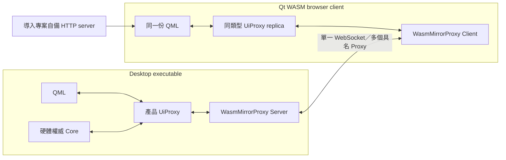
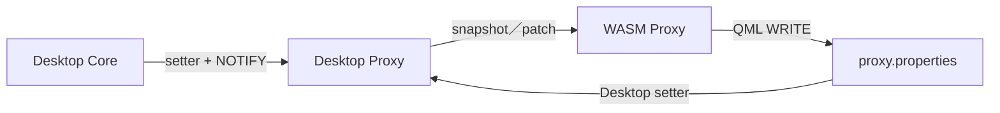

# Wasm Mirror Package 導入手冊

本文件說明如何把 `wasm-mirror` package 放入一個既有 Qt/QML 專案，讓同一份
QML Proxy API 同時支援 Desktop 與 Qt WebAssembly。

本文件聚焦在 package 接線。協定、重連狀態機、revision、防重播及內部實作細節
請參考 [`docs/wasm-mirror-integration.md`](docs/wasm-mirror-integration.md)。

## 1. 導入後的架構



重要原則：

- Desktop 的 Proxy 是 authoritative state，硬體 Core 只在 Desktop 建立。
- WASM 建立同一 concrete Proxy class，但不建立 Modbus、OPC UA、PLC thread 等
  硬體物件。
- QML 與 Mirror Config 必須取得同一個 Proxy instance。
- 每一個 Web client 以一條 WebSocket 同步 Config 中的所有具名 Proxy。
- 純計算、無 I/O、無全域可變狀態的 local Core，可以在 Desktop/WASM 各自建立，
  但它的狀態不應冒充 Desktop authoritative state。

## 2. Package 提供與不提供的內容

Package 已提供：

- Desktop WebSocket server 與 WASM WebSocket client。
- 多 Proxy 註冊與 `mirrorName` 路由。
- Q_PROPERTY full snapshot、增量 patch 與雙向 property write。
- 一般 typed signal 的 WASM → Desktop relay。
- contract hash、session、revision、防重播與 echo suppression。
- handshake timeout、斷線偵測與自動退避重連。
- required／optional Proxy 與選配 transport UI callback。
- CMake relay generator、native tests 與 consumer example。

導入專案仍須提供：

- QML、產品 Proxy、Core 與硬體控制程式。
- WASM 頁面的 HTTP server。
- HTML／JavaScript／WASM／`qtloader.js` 部署位置。
- Desktop 與 WASM 的 CMake presets／CLion profiles。
- 若需要離線提示，由產品 Proxy/QML 提供本機 transport overlay。

## 3. 複製 Package

請複製整個發佈目錄，不可只複製幾個 `.cpp`：

```text
MyExistingProject/
├─ CMakeLists.txt
├─ CMakePresets.json
├─ src/
└─ third_party/
   └─ wasm-mirror/
      ├─ CMakeLists.txt
      ├─ cmake/
      ├─ src/
      ├─ tests/
      ├─ templates/
      ├─ VERSION
      └─ MANIFEST.sha256
```

`src/`、`cmake/` 與 generator 是同一版本的 Module implementation。更新時應整包
替換，並用 `MANIFEST.sha256` 驗證檔案，不要混用不同版本。

所有 `build-*`、`CMakeCache.txt`、`.obj`、`.pdb` 及產物目錄都不屬於 package
發佈內容。它們可能包含建立者電腦的絕對路徑；直接複製或製作 ZIP 時必須排除。
`.gitignore` 只能保護 Git commit，不能自動從手動壓縮檔移除這些內容。

## 4. 必要工具與 Qt modules

- CMake 3.21 以上。
- C++17。
- Qt 6.8.x：`Core`、`Network`、`WebSockets`。
- QML 應用另外需要 `Gui`、`Qml`、`Quick`、`QuickControls2`。
- Windows Desktop 使用 MSVC Qt kit。
- Qt WASM 使用 `wasm_singlethread`。
- Qt 6.8.3 對應 Emscripten 3.1.56。
- 本團隊 EMSDK 路徑：`C:/tools/emsdk`。

Package 不依賴 `SerialBus`、`HttpServer` 或 `Qt6::Test`；這些應依產品 target
分別加入。

## 5. 接入 CMake

### 5.1 加入 library

```cmake
set(WASM_MIRROR_PACK_DIR
    "${CMAKE_CURRENT_SOURCE_DIR}/third_party/wasm-mirror")

add_subdirectory(
    "${WASM_MIRROR_PACK_DIR}"
    "${CMAKE_BINARY_DIR}/wasm-mirror-pack"
)

target_link_libraries(MyApplicationCore
    PUBLIC
        WasmMirror::Core
)
```

`MyApplicationCore` 可以是 executable 或最後一定會被 executable link 的 library。
上例使用 `PUBLIC`，讓分離的 final executable/main.cpp 也能取得 Mirror 的 include
與 link usage requirements。若所有 Mirror 呼叫都和 Proxy 位於同一 executable target，
該 executable 可改用 `PRIVATE`。

### 5.2 開啟 AUTOMOC

含有 `Q_OBJECT` Proxy 的 target 必須啟用 AUTOMOC：

```cmake
set_target_properties(MyApplicationCore PROPERTIES AUTOMOC ON)
```

若專案已有全域 `CMAKE_AUTOMOC ON`，這行可以省略。

### 5.3 註冊 concrete Proxy class

```cmake
include("${WASM_MIRROR_PACK_DIR}/cmake/WasmMirrorProxyRegister.cmake")

wasm_mirror_register_proxy(
    TARGET MyApplicationCore
    CLASS OpcUaKepwareProxy
    HEADER "${CMAKE_CURRENT_SOURCE_DIR}/src/proxy/opcuakepwareproxy.h"
)

wasm_mirror_register_proxy(
    TARGET MyApplicationCore
    CLASS AlarmProxy
    HEADER "${CMAKE_CURRENT_SOURCE_DIR}/src/proxy/alarmproxy.h"
)

wasm_mirror_finalize_proxy_registration(TARGET MyApplicationCore)
```

規則：

1. target、include directories 與 compile definitions 都設定完成後才 register。
2. 每一種 concrete C++ class 註冊一次。
3. 同一 class 的多個 instance 不重複 register。
4. 全部 class 註冊後只呼叫一次 `finalize`。
5. `finalize` 後不可再 register。
6. Desktop Host 可從 meta-object 讀取狀態；WASM typed signal relay 必須有 generator
   產物，因此 WASM 最終連結的 target 一定要完成這段註冊。

### 5.4 Desktop-only 項目必須條件化

Windows host 上交叉編譯 WASM 時，`CMAKE_HOST_WIN32` 仍為 true。請先判斷
`EMSCRIPTEN`，不要把 host OS 當 target platform：

```cmake
include(CTest)

set(MYAPP_IS_WASM OFF)
set(MYAPP_IS_WINDOWS_DESKTOP OFF)

if(EMSCRIPTEN)
    set(MYAPP_IS_WASM ON)
elseif(WIN32)
    set(MYAPP_IS_WINDOWS_DESKTOP ON)
else()
    message(FATAL_ERROR "Unsupported target platform")
endif()

find_package(Qt6 6.8 REQUIRED COMPONENTS
    Core Gui Network Qml Quick QuickControls2 WebSockets
)

if(MYAPP_IS_WINDOWS_DESKTOP)
    set(MYAPP_DESKTOP_COMPONENTS SerialBus HttpServer)
    if(BUILD_TESTING)
        list(APPEND MYAPP_DESKTOP_COMPONENTS Test)
    endif()
    find_package(Qt6 6.8 REQUIRED COMPONENTS
        ${MYAPP_DESKTOP_COMPONENTS}
    )
endif()

if(MYAPP_IS_WINDOWS_DESKTOP)
    target_sources(MyApplicationCore PRIVATE
        # Modbus、OPC UA、WebGateway、硬體 Core 等 Desktop-only source
    )
    target_link_libraries(MyApplicationCore PRIVATE
        Qt6::SerialBus
        Qt6::HttpServer
    )
endif()

if(MYAPP_IS_WINDOWS_DESKTOP)
    set_target_properties(MyApplication PROPERTIES WIN32_EXECUTABLE TRUE)
endif()

if(MYAPP_IS_WINDOWS_DESKTOP AND BUILD_TESTING)
    add_subdirectory(tests)
endif()
```

必須一起條件化的內容包括：

- Desktop-only `find_package()` components。
- Desktop-only source files。
- Desktop-only imported targets／link libraries。
- `WIN32_EXECUTABLE`。
- Desktop-only tests。

只隱藏 source、不隱藏 `find_package(SerialBus/Test)`，WASM configure 仍會失敗。

## 6. Proxy contract

### 6.1 要同步的 property

每個會被 Mirror 同步的 Q_PROPERTY 都必須有 READ、WRITE、NOTIFY：

```cpp
Q_PROPERTY(int testCount
           READ testCount
           WRITE setTestCount
           NOTIFY testCountChanged)
```

```cpp
int testCount() const;
void setTestCount(int value);

signals:
    void testCountChanged(int value);
```

```cpp
void OpcUaKepwareProxy::setTestCount(int value)
{
    if (m_testCount == value) {
        return;
    }

    m_testCount = value;
    emit testCountChanged(m_testCount);
}
```

NOTIFY 可以是零參數，或帶一個與 property 相容的參數。setter 必須在值沒有改變時
停止發 signal，這是避免循環與重複 patch 的第一層保護。

同步方向：



Mirror 會在套用遠端狀態時抑制 echo，因此不需要在產品 setter 裡加入 Mirror 判斷。

### 6.2 不同步的本機 property

只服務目前 target 的 UI 狀態使用 `STORED false`：

```cpp
Q_PROPERTY(bool transportReady
           READ transportReady
           NOTIFY transportReadyChanged
           STORED false)
```

`CONSTANT` 與 `STORED false` 不進 Mirror contract。適合放：

- WASM transport ready/offline 狀態。
- 平台名稱、runtime 描述。
- 只在本機計算的 UI metadata。

### 6.3 一般 signal

public signal 若不是某個 Q_PROPERTY 的 NOTIFY，會被視為 WASM UI event，轉送到
Desktop 同一類型 Proxy。名稱不需要 `request` 前綴：

```cpp
signals:
    void startRequested(int seconds);
    void acknowledgeAlarm(QString alarmId);
```

Desktop 保留原本的 signal/slot 接線：

```cpp
QObject::connect(opcua,
                 &OpcUaKepwareProxy::startRequested,
                 &core,
                 &Core::startSequence);
```

沒有 handler 不算 Mirror 錯誤，只代表該功能目前停用。Q_PROPERTY NOTIFY signal
也仍是普通 Qt signal，Desktop Core 可額外 connect 它做後續處理；Mirror 只會把它
辨識為狀態通知，不會當成第二個 UI event 再 dispatch。

### 6.4 兩端 contract 必須一致

Desktop 與 WASM 必須編譯同一 concrete Proxy class／header。不要用平台條件增刪：

- Q_PROPERTY。
- property 型別、READ／WRITE／NOTIFY。
- public signal 的名稱、型別與參數順序。

平台差異應放在建構模式、Core 接線或 `STORED false` 本機狀態，不應改變
meta-object contract。

## 7. 在 main 建立 Mirror

以下以既有 singleton Core 與 `OpcUaKepwareProxy` 為例：

```cpp
#include "infrastructure/proxy_mirror/wasmmirrorproxy.h"

int main(int argc, char *argv[])
{
    QApplication app(argc, argv);
    QQmlApplicationEngine engine;

#if !defined(Q_OS_WASM)
    Core &core = Core::instance();
    core.init();
#endif

    // Desktop/WASM 都建立同一 concrete Proxy class。
    auto *opcua = obtainOpcUaProxy();

    qmlRegisterSingletonInstance<OpcUaKepwareProxy>(
        "Core", 1, 0, "OpcuaKepware", opcua);

    WasmMirrorConfig config;
    config.host = QStringLiteral("127.0.0.1");
    config.port = 8125;
    config.path = QStringLiteral("/mirror");
    config.allowedOrigins = {
        QStringLiteral("http://127.0.0.1:8123"),
        QStringLiteral("http://localhost:8123")
    };

    WasmMirrorProxyOptions options;
    options.required = true;

#if defined(Q_OS_WASM)
    // 只有產品 UI 需要 offline/ready overlay 時才設定。
    // Desktop 保持 member 的 true 預設；只有 WASM 在 QML 載入前切成 false。
    opcua->setTransportState(
        false, QStringLiteral("Connecting to the Qt desktop Core..."));
    options.transportStateHandler =
        [opcua](bool ready, const QString &message) {
            opcua->setTransportState(ready, message);
        };
#endif

    if (!config.addProxy(QStringLiteral("Opcua"),
                         *opcua,
                         std::move(options))) {
        qCritical().noquote() << config.validationError();
        return EXIT_FAILURE;
    }

    QString mirrorError;
    auto mirror = WasmMirrorProxy::create(config, &mirrorError);
    if (!mirror) {
        qCritical().noquote() << mirrorError;
        return EXIT_FAILURE;
    }

    qInfo().noquote()
        << "WASM Mirror endpoint:"
        << mirror->webSocketUrl().toString();

    engine.load(mainQmlFile);
    if (engine.rootObjects().isEmpty()) {
        return EXIT_FAILURE;
    }

    // mirror 必須活到 event loop 結束。
    return app.exec();
}
```

生命週期順序：

1. 建立 application。
2. 建立所有 Proxy。
3. Desktop 才建立/初始化硬體 Core。
4. 建立 Config 並 `addProxy()`。
5. `WasmMirrorProxy::create()`。
6. 載入 QML。
7. Mirror runtime 必須比所有已註冊 Proxy 更早析構。

若既有 Proxy constructor 會直接連硬體、開 thread 或建立 Desktop singleton，才需要
新增類似 `Authoritative`／`MirrorReplica` 的建構模式。若 Proxy 本身只是乾淨狀態容器，
不需要為 Mirror 修改 constructor。

## 8. 多個 Proxy

同一個 Config 可加入多個不同 class 或多個相同 class instance：

```cpp
WasmMirrorConfig config;
config.port = 8125;

config.addProxy(QStringLiteral("MachineA"), machineA);
config.addProxy(QStringLiteral("MachineB"), machineB);
config.addProxy(QStringLiteral("Alarm"), alarmProxy);

auto mirror = WasmMirrorProxy::create(config, &error);
```

- `mirrorName` 必須非空且唯一。
- 相同 C++ class 在 CMake 只 register 一次。
- 每個 mirrorName 有自己的 contract、state session 與 revision。
- Config 在 `create()` 時形成 runtime snapshot；之後要新增/移除 Proxy，必須重建
  runtime 並讓 client 重連。
- 預設 `required=true`。required contract 不一致時，整次 handshake 原子拒絕，
  不會先同步一半。

## 9. transportStateHandler

`transportStateHandler` 是選配的產品 UI callback，不是 property/signal 同步的必要條件。
WASM client 的連線狀態改變時，Mirror 可藉此呼叫 Proxy 的本機 setter：

共用 Proxy 的 overlay member 應預設為 `true`，確保 Desktop 不會因等待一個不存在的
遠端 transport 而停用 UI：

```cpp
bool m_transportReady = true;
```

只有 WASM composition root 在載入 QML 前明確切成 `false`，再安裝 handler：

```cpp
#if defined(Q_OS_WASM)
proxy.setTransportState(
    false, QStringLiteral("Connecting to the Qt desktop Core..."));

options.transportStateHandler =
    [&proxy](bool ready, const QString &message) {
        proxy.setTransportState(ready, message);
    };
#endif
```

適用情況：

- 頁面需要顯示 `Synchronizing`／`Offline`。
- 斷線時需要停用會直接寫 property 或 emit event 的 controls。
- QML enable condition 使用 `transportReady`。

不適用／可省略情況：

- 頁面只需保留最後 snapshot 並在背景自動重連。
- UI 不顯示 transport 狀態。
- readiness 由產品自己的 service 提供。

若有實作 overlay，請用 `STORED false` 排除同步，否則 WASM 的離線狀態可能被反向
寫進 Desktop authoritative state。

多 Proxy 時 callback 是 per-proxy 狀態，不等於 runtime 的全域 `isReady()`；全域 ready
需等待所有 required Proxy 收到完整 snapshot。

## 10. HTTP server 由導入專案自備

WasmMirrorProxy 只處理 WebSocket，不提供 WASM 靜態檔案 HTTP server。導入專案必須
透過 HTTP(S) 提供：

```text
MyApplication.html
MyApplication.js
MyApplication.wasm
qtloader.js
```

基本要求：

- `.wasm` MIME type：`application/wasm`。
- 不可用 `file://` 開啟。
- Browser Origin 必須加入 `config.allowedOrigins`。
- HTTP 頁面使用 `ws://`；HTTPS 頁面需要 `wss://` 或同源 reverse proxy。
- 開發範例：HTTP `127.0.0.1:8123`，Mirror WS `127.0.0.1:8125`。
- HTTP 與 WebSocket port 必須分開，且啟動前都可用。

詳細要求見
[`docs/http-server-requirements.md`](docs/http-server-requirements.md)。

## 11. CLion 建置

本 package 不要求 `.cmd`／`.ps1`。請在導入專案建立 CMake configure/build presets。
可從 [`templates/CMakePresets.example.json`](templates/CMakePresets.example.json)
複製後改 target 名稱。

### Desktop

- Toolchain：Visual Studio／MSVC。
- Qt：`C:/Qt/6.8.3/msvc2022_64`。
- Generator：Ninja。
- `BUILD_TESTING=ON`。

### WASM

- Target Qt：`C:/Qt/6.8.3/wasm_singlethread`。
- Host Qt：`C:/Qt/6.8.3/msvc2022_64`。
- EMSDK：`C:/tools/emsdk`。
- Emscripten：3.1.56。
- `BUILD_TESTING=OFF`。
- Build preset 必須繼承 configure preset environment，讓 build 階段仍能找到
  EMSDK Python／Node／`em++.bat`。

WASM configure 與 Desktop 必須使用不同 build directory/cache。

## 12. 導入驗收

### 12.1 自動驗證

先把 package 當 top-level CMake project 建置：

```text
WASM_MIRROR_BUILD_TESTS=ON
```

CTest 應通過：

```text
WasmMirror.Engine
WasmMirror.Runtime
```

接著驗證導入專案：

1. Desktop MSVC configure/build 成功。
2. WASM configure/build 成功。
3. 產生 HTML、JavaScript、WASM 與 `qtloader.js`。
4. 每種 Proxy 的 contract hash 在 Desktop/WASM 一致。

### 12.2 Browser 驗收

必測：

1. Desktop 啟動後 Mirror endpoint 成功 listen。
2. HTTP server 可載入 WASM 頁面。
3. 所有 required Proxy 收到 snapshot 後才 ready。
4. Desktop setter/NOTIFY 可更新 WASM QML，不 reload。
5. WASM 修改允許雙向寫入的 property，Desktop setter 只執行一次。
6. WASM emit 一般 typed signal，Desktop Core slot 只執行一次。
7. 停止 Desktop 後，不再向舊 session 傳送 write/event。
8. 同 port 重啟 Desktop 後，WASM 自動重連並取得新 full snapshot。
9. 重連過程不需要重新整理頁面。

條件測項：只有實作 `transportStateHandler`／本機 overlay 的專案，才要求頁面顯示
offline 並停用所有會直接寫 mirrored property 或 emit event 的 controls。

## 13. 常見問題

### `Mirrored property ... must be readable, writable and use a NOTIFY signal`

該 property 缺少 READ、WRITE 或 NOTIFY，或 NOTIFY 參數型別不相容。若它本來就不應
同步，改成 `STORED false` 或 `CONSTANT`。

### Desktop 正常，WASM signal 沒有到 Core

檢查：

- concrete Proxy class 是否 register/finalize。
- Proxy target 是否啟用 AUTOMOC。
- signal 是否為 public typed signal。
- Desktop Core 是否真的 connect handler。
- QML 與 Config 是否使用同一 QObject instance。
- Desktop/WASM 是否使用同一 header contract。

### WASM 一直停在 Synchronizing

檢查：

- Desktop port/path 是否與 WASM Config 一致。
- Origin 是否在 allowlist。
- required Proxy 名稱與 contract 是否一致。
- Proxy 是否比 runtime 活得久。
- Browser console 是否顯示 protocol/contract mismatch。

### 頁面載入但 WebSocket 連不上

Mirror 不提供 HTTP server。確認頁面不是 `file://`，並確認 HTTP port、Mirror port、
`allowedOrigins`、防火牆與反向代理設定。

### Windows GUI 看不到 endpoint log

在 CLion Run Configuration 加入：

```text
QT_FORCE_STDERR_LOGGING=1
```

### 專案的架構檢查誤報 package 內的 `connect()`

Package 內部會使用 Qt signal/slot 實作 transport。導入方的產品架構靜態檢查應排除
`third_party/wasm-mirror`，再檢查自己的 Core/Proxy 接線。

## 14. 最終檢查表

- [ ] 整個 package 已以同一版本複製。
- [ ] 發佈內容不含 `build-*`、`CMakeCache.txt` 或本機編譯產物。
- [ ] `MANIFEST.sha256` 驗證通過。
- [ ] Host target 已 link `WasmMirror::Core`。
- [ ] Proxy target 已啟用 AUTOMOC。
- [ ] 每種 concrete Proxy class 已 register，最後已 finalize。
- [ ] 每個同步 Q_PROPERTY 都有 READ／WRITE／NOTIFY。
- [ ] 本機狀態已用 `STORED false` 或 `CONSTANT` 排除。
- [ ] Desktop/WASM 使用同一 concrete Proxy contract。
- [ ] QML 與 Config 使用同一 QObject instance。
- [ ] 硬體權威 Core 只在 Desktop 建立。
- [ ] Desktop-only Qt components、sources、tests 與 WIN32_EXECUTABLE 已條件化。
- [ ] Proxy 與 runtime 在 GUI/main thread。
- [ ] Proxy 比 runtime 活得久。
- [ ] 多個 Proxy 的 mirrorName 唯一。
- [ ] Desktop/WASM 的 host、port、path 一致。
- [ ] HTTP server、MIME、Origin 與 WASM assets 設定完成。
- [ ] Native tests、Desktop build、WASM build、browser property/signal/reconnect 通過。
- [ ] 若有 transport overlay，offline UI 與 controls disabled 已驗證。

可直接參考已驗證範例：

- [`examples/consumer/CMakeLists.txt`](examples/consumer/CMakeLists.txt)
- [`examples/consumer/exampleproxy.h`](examples/consumer/exampleproxy.h)
- [`examples/consumer/main.cpp`](examples/consumer/main.cpp)
